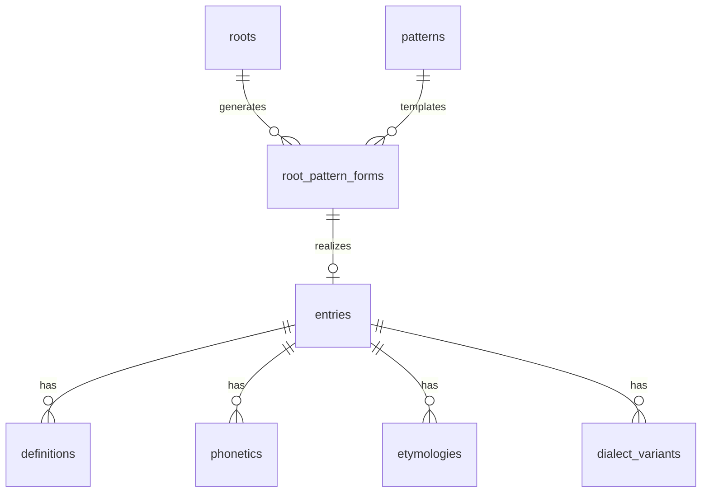

# Data Model (Contributor Guide)

This document is a concise onboarding guide to the Il-Miġma’ linguistic schema.
For the exhaustive field-by-field reference, see [`docs/schema.md`](./schema.md).

## 1) Core design idea

Il-Miġma’ keeps **abstract morphology** separate from **surface dictionary forms**.

- Abstract layer: roots + patterns
- Surface layer: entries + senses + phonetics + etymology

That split is what lets the project behave as both dictionary and morphology engine.

## 2) Primary entities

## `roots`

Represents a Semitic consonantal skeleton (`k-t-b`) plus metadata used by generation and filtering.

Important fields:
- `consonants` (`k-t-b`)
- `consonant_array` (JSON array of radicals)
- `strength` / `weak_class`
- `vowel_set_perf` / `vowel_set_impf` / `vowel_set_imp`
- `gloss`, `etymology`, `synonyms`, `antonyms` (JSON-in-TEXT)

## `patterns`

Stores templates such as CV notation and wiżen labels.

Important fields:
- `cv_notation`
- `wizen_notation`
- `example_word`

## `root_pattern_forms`

Junction table that materializes root + pattern combinations into a derived form.

Important fields:
- `root_id`
- `pattern_id`
- `derived_form`

## `entries`

Primary lexical entity shown in UI and returned by search.

Important fields:
- `headword`, `pos`
- `root_consonants`, `cv_pattern`, `verb_form`
- `root_pattern_form_id` (nullable for loanwords)
- noun, verb, adjective morphology fields
- `is_loanword`, `source_language`

## 3) Supporting lexical entities

- `definitions`: bilingual sense rows (`text_mt`, `text_en`).
- `phonetics`: IPA transcriptions tied to entry or subentry.
- `etymologies`: JSON etymology chain nodes.
- `dialect_variants`: region-specific variant forms.
- `lexical_sources` + `attestation_*`: source weighting and reliability index.

## 4) JSON-in-TEXT pattern

Because SQLite/libSQL stores JSON as text columns, many fields require parsing and normalization on read.

Common JSON-backed columns include:
- `roots.consonant_array`
- `roots.gloss`, `roots.etymology`
- `roots.synonyms`, `roots.antonyms`, `roots.related_entries`, `roots.hidden_forms`
- `entries.noun_plural_forms`, `entries.tags`
- `etymologies.chain`

When editing admin/data code, treat these as structured values, not opaque strings.

## 5) Relationship map

## 6) Typical contributor tasks

- **Add a new root:** insert into `roots`, then link derivations via `root_pattern_forms` and `entries`.
- **Add a dictionary entry:** create `entries` row + at least one `definitions` row.
- **Improve conjugation behavior:** validate `roots.strength`, `weak_class`, and per-tense vowel sets.
- **Update trust metadata:** adjust `lexical_sources` weights and recompute `attestation_reliability`.

## 7) Read next

- [`docs/schema.md`](./schema.md) for deep schema semantics.
- [`db/schema.sql`](../db/schema.sql) for authoritative DDL.
- [`src/types/index.ts`](../src/types/index.ts) for runtime shape expectations.
