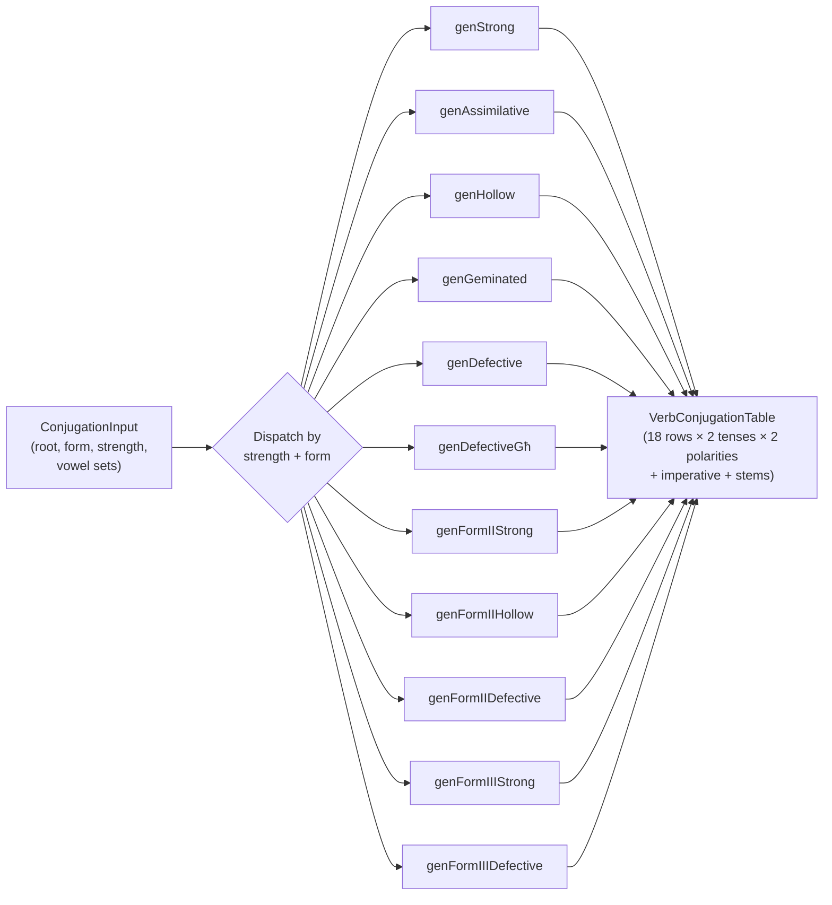

# Linguistic & Logic Rules

> This document explains the **phonological and morphological rules** encoded in the conjugation and suffix engines. It is not a grammar textbook — it describes what the *code does* and why.

---

## The Conjugation Engine Pipeline



### Input Structure

| Field | Example | Meaning |
|---|---|---|
| `root` | `"k-t-b"` | Consonants (C1-C2-C3) |
| `form` | `"I"` | Verb derivation form |
| `strength` | `"strong"` | Determines which generator to use |
| `vowelSetPerfect` | `"i-e"` | V1-V2 for the perfect tense |
| `vowelSetImperfect` | `"i-e"` | V1-V2 for the imperfect tense |
| `vowelSetImperative` | `"i-o"` | V1-V2 for the imperative |
| `isImalaBlocked` | `false` | If true, suppress the `a→ie` shift |

---

## Verb Classes & Their Rules

### Strong (CvCvC / jCvCvC)

The baseline. Consonants stay stable; vowels are inserted per the vowel set.

- Perfect: `C1 + V1 + C2 + V2 + C3` → *kiteb*
- Imperfect: `prefix + C1 + C2 + V2 + C3` → *jikteb*
- Negation shifts: `V2(e) → V2(i)` in attached stems (*kitib-*)

### Assimilative (C1 = w/j)

C1 is a semivowel that is present in the perfect but **drops** in the imperfect.

- Perfect: Same as strong → *wiret* (he inherited)
- Imperfect: C1 drops, prefix absorbs → *jiret* (not ~~*jwiret*~~)

### Hollow (C2 absorbed into long vowel)

C2 doesn't surface as a distinct consonant. Instead, a long vowel appears between C1 and C3.

- Perfect 3sg: `C1 + long_vowel + C3` → *dar* (ā replaces C2)
- Imperfect: `prefix + C1 + long_vowel + C3` → *jdur*
- Suffix attachment shortens the long vowel → *dort* (1sg perfect)

### Geminated (C2 = C3)

The second and third radicals are identical and surface as a doubled consonant.

- Perfect: `C1 + V + C2C2` → *ħabb* (he loved)
- Imperfect: `prefix + C1 + V + C2C2` → *jħobb*
- Plural suffix breaks the geminate → *ħabb-ew* (not ~~*ħabbew*~~)

### Defective (C3 = j/w — vocalised)

C3 is a weak consonant that vocalises to `-a` in the perfect and `-i` in the imperfect.

- Perfect: `C1 + V + C2 + a` → *beda* (he began)
- Imperfect: `prefix + C1 + C2 + i` → *jibdi*

### Defective-Għ (C3 = għ)

A special sub-class where C3 is the pharyngeal fricative `għ`. In the perfect it surfaces as trailing `-a'`; the imperfect behaves like strong.

- Perfect: `C1 + V + C2 + V + għ` → *qataʼ* (he cut)
- Imperfect: Strong-like → *jaqtaʼ*

---

## Form II & III Patterns

### Form II — Intensive/Causative (doubled C2)

Pattern: `C1 + V + C2C2 + V + C3`

- Strong: *fettaħ* (he opened) / *jfettaħ*
- Hollow: *dawwar* (he turned) / *jdawwar*
- Defective: *maħħa* (he erased) / *jmaħħi*

### Form III — Reciprocal/Prolonged (long vowel after C1)

Pattern: `C1 + ie + C2 + V + C3`

- Strong: *bierek* (he blessed) / *jbierek*
- Defective: *bieda* (he began with) / *jbiedi*

---

## The Suffix Engine Rules

### Clitic Attachment Types

When a pronoun suffix is attached to a verb, the stem must be phonologically adjusted. Two adjustment types exist:

| Type | Trigger | What it does | Example |
|---|---|---|---|
| **Type 1 (Attached)** | Consonant-initial suffix (-ni, -ha, -hom) | Shifts theme vowel: `e → i` | *jikteb* → *jiktib-ni* |
| **Type 2 (Syncopated)** | Vowel-initial suffix (-u, -ok) | Drops theme vowel entirely (if possible) | *jikteb* → *jiktb-u* |

### Syncopation with Sonorant Licensing

When Type 2 drops the vowel, the resulting cluster must be phonotactically valid. If removing the vowel creates a C-Sonorant-C cluster (where the middle consonant is a sonorant like l, r, m, n, ġ, w, j), the vowel is **preserved** or an epenthetic `i` is inserted.

```
jikteb → jiktb-u     ✓ (t-b is OK)
jifhem → jifahm-u    ✓ (sonorant h+m needs a vowel)
```

### Imāla (a → ie)

The imāla is an automatic vowel shift from terminal `-a` to `-ie` when the word becomes word-internal (e.g. by suffix attachment) or stressed under negation.

```
beda  → bdie-t      (a → ie before -t suffix)
qata' → NOT shifted  (blocked by pharyngeal C3)
```

The `blocksImala` flag on `VerbConjugationTable` suppresses this shift for verbs with a final guttural consonant.

### ie-Collapse Rule

When `ie` appears in a non-final position (after suffix attachment), it collapses to `i` (or `e` for Form III roots):

```
bdie-t  → bdit       (ie → i before consonant cluster)
biered  → bierd-u    (Form III: ie may collapse to e)
```

### Negation Wrapping

Maltese verb negation uses a **circumfix**: `ma ... x` (or `ma ... ʃ`).

```
positive: nikteb      → negative: ma niktibx
positive: niktb-u     → negative: ma niktibhomx
```

The `negWrap()` function handles this wrapping, including ie-collapse at the boundary.

### Direct Object (DO) & Indirect Object (IO) Suffixes

| Idx | DO | IO |
|---|---|---|
| 0 | -ni (me) | -li (to me) |
| 1 | -ek/-ok (you) | -lek/-lok (to you) |
| 2 | -u/-h (him) | -lu (to him) |
| 3 | -ha (her) | -lha (to her) |
| 4 | -na (us) | -lna (to us) |
| 5 | -kom (you pl.) | -lkom (to you pl.) |
| 6 | -hom (them) | -lhom (to them) |

**Round vowel rule:** When the vowel set contains `o` (e.g. `"o-o"` or `"i-o"`), certain suffixes shift: `-ek → -ok`, `-lek → -lok`.

**needsIl rule:** When the stem ends in a consonant cluster, IO suffixes 3–6 get an epenthetic `-il-` inserted: `-lha → -ilha`, `-lna → -ilna`.

---

## Root Form Generation

The `generateRootForms()` function takes a set of consonants and generates **all possible verb forms** (Form I, II, III) across all derivation patterns. Each form includes perfect, imperfect, active participle, passive participle, and verbal noun.

### Attested vs Unattested Marking

After generation, `markGeneratedForms()` cross-references each generated form against attested dictionary entries:

| Marker | Meaning |
|---|---|
| `attested` | Exact match found in `entries` table |
| `irregular` | Entry exists but the surface form differs from the generated one |
| `unattested` | No matching entry — the form is theoretically possible but not recorded |

This three-way marking drives the UI: attested forms are shown normally, irregular forms get a warning badge, and unattested forms are dimmed.

---

## Terminology System

The `terminology.ts` module provides **bilingual term resolution**. Every linguistic label in the UI has two variants:

| Mode | Label for "verb" | Label for "noun" |
|---|---|---|
| **Standard** | *Verb* (English / Standard Maltese) | *Nom* |
| **Arabised** | *Filgħi* (Arabised Maltese calque) | *Isem* |

The user toggles between modes via a UI setting. All labels are resolved through `resolveTerm(key, mode)` — components never hardcode linguistic terminology.
