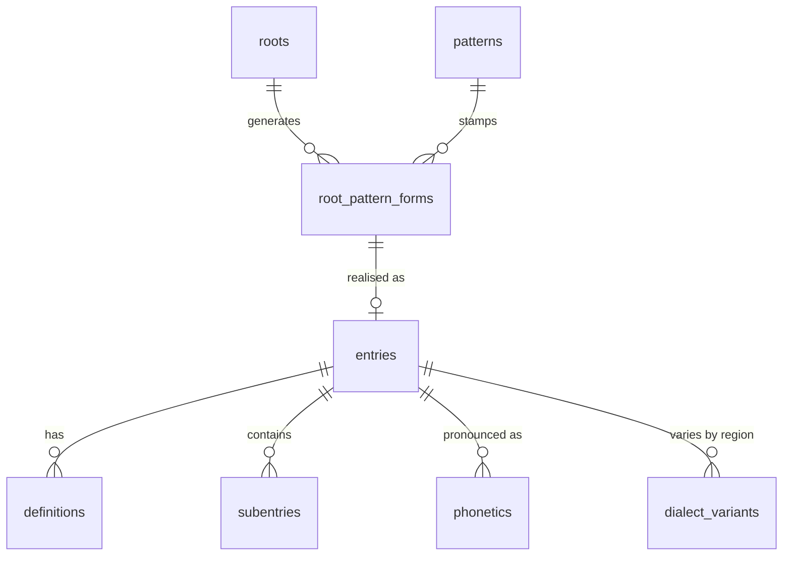

# Data Schema — The Meaning Behind the Fields

> Database: **Turso** (libSQL / SQLite-compatible). Schema source: [`db/schema.sql`](file:///c:/Projects/il-migma/db/schema.sql). TypeScript types: [`src/types/index.ts`](file:///c:/Projects/il-migma/src/types/index.ts).

---

## Core Concepts

### Semitic Root vs Romance Stem (Their definition will always be in English gerund form)

This is the single most important distinction in the data model.

| Concept | Example | Where it lives |
|---|---|---|
| **Semitic root** | `k-t-b` (writing) | `roots.consonants` — a dash-separated consonant skeleton |
| **Romance stem** | `-skriv-` (inscribing) | `entries.headword` with `is_loanword = 1` |

A Semitic root is **not a word**. It is an abstract consonantal template from which many surface forms are derived via **patterns** (wiżen). The root `k-t-b` generates *kiteb* (he wrote), *ktieb* (book), *miktub* (written), etc. Each derived surface form lives in the `entries` table and is linked back to its root via `root_pattern_forms`.

A Romance/English stem is also **not a word**. It is an abstract consonantal template from which many surface forms are derived via **patterns** (wiżen). The stem `-skriv-` generates *iskriva* (he inscribed), *jiskrivi* (he inscribes), *skritt* (inscribed), *skrizzjoni* (inscription), etc. Each derived surface form lives in the `entries` table and is linked back to its stem via `stem_pattern_forms`.

A loanword has **no root-pattern relationship**. The word `mowbajl` is stored directly in `entries` with `is_loanword = 1` and `source_language = 'English'`. Its `root_consonants` and `root_pattern_form_id` are `NULL`.

### Root → Pattern → Entry Pipeline

---

## Table-by-Table Reference

### `roots` — The Consonantal Skeletons

| Column | Type | Meaning |
|---|---|---|
| `id` | TEXT PK | Unique ID; typically equals `consonants` but can be suffixed (e.g. `k-t-b-2`) for homographic roots |
| `consonants` | TEXT | Dash-separated radical consonants, e.g. `"k-t-b"`. **Not unique** — two roots can share consonants if they have different meanings. |
| `consonant_array` | TEXT (JSON) | Same radicals as a JSON array: `["k","t","b"]`. Redundant but avoids constant splitting. |
| `strength` | TEXT | Morphological class: `'strong'`, `'weak'`, `'geminated'`, `'strong-hybrid'` |
| `weak_class` | TEXT | Sub-classification when `strength = 'weak'`: `'hollow'`, `'assimilative'`, `'defective'` |
| `gloss` | TEXT (JSON) | JSON array of `{en, mt}` gloss objects. **Not a plain string** — always parse with `normalizeRootGloss()`. |
| `etymology` | TEXT (JSON) | JSON object `{relationship, language, term, pronunciation, definition}`. Parse with `normalizeRootEtymology()`. |
| `vowel_set_perf` | TEXT | Vowel pattern for the **perfect tense**, e.g. `"i-e"` (for *k**i**t**e**b*). Format: `"V1-V2"`. |
| `vowel_set_impf` | TEXT | Vowel pattern for the **imperfect tense**, e.g. `"i-e"` (for *j**i**kt**e**b*). |
| `vowel_set_imp` | TEXT | Vowel pattern for the **imperative**, e.g. `"i-o"` (for *ikt**o**b*). |
| `hidden_forms` | TEXT (JSON) | JSON array of theoretic verb form labels (e.g. `["Form II"]`) that should be suppressed in the UI. |
| `synonyms` | TEXT (JSON) | JSON array of `{id, headword, gloss_en, gloss_mt}` — linked root synonyms. Reciprocal updates managed by server. |
| `antonyms` | TEXT (JSON) | Same structure as synonyms. |
| `related_entries` | TEXT (JSON) | Same structure — cross-references to entries derived from this root. |

> [!IMPORTANT]
> **Vowel sets are per-tense, not per-root.** A root can have `vowel_set_perf = "i-e"` and `vowel_set_impf = "o-o"`. The conjugation engine reads all three separately.

### `patterns` — The CV Templates

| Column | Meaning |
|---|---|
| `cv_notation` | Abstract consonant-vowel template, e.g. `"CaCaC"`, `"CvCvC"` |
| `wizen_notation` | Arabised name using the template root ف-ع-ل (f-għ-l), e.g. `"Fagħal"` |
| `description` | Linguistic notes or usage guidance |

### `pattern_applicability` — Pattern Presets & Roles

Determines which patterns appear as suggestions in the Admin Entry Form based on POS and linguistic requirements.

| Column | Meaning |
|---|---|
| `category` | The administrative category (e.g. `'broken_plural'`, `'feminine_pattern'`) |
| `pos` | Part of speech mask (`'noun'`, `'adjective'`, or `'all'`) |
| `linguistic_role` | Explicit role (e.g. `'feminine_singular'`, `'broken_plural'`) used for targeted filtering |
| `gender` | Target gender (if applicable) |
| `metadata` | JSON blob for forward-compatible extras and legacy notes |
| `stress` | Syllable count from the end for stress placement |

### `root_pattern_forms` — The Junction

Links a root to a pattern and stores the **surface realisation** (the actual word). Example: root `k-t-b` + pattern `CiCeC` → derived_form `kiteb`.

### `entries` — The Dictionary Headwords

The central table. Every word in the dictionary is an entry.

| Column | Meaning |
|---|---|
| `headword` | The display word, e.g. `"kiteb"` |
| `pos` | Part of speech (constrained enum: noun, verb, adjective, etc.) |
| `root_consonants` | Denormalized copy of the root consonants for query convenience |
| `cv_pattern` | The CV pattern used for this specific entry |
| `root_pattern_form_id` | FK to the junction table (may be NULL for loanwords) |
| `is_loanword` | `0` = Semitic / `1` = Romance/borrowed |
| `source_language` | Origin language when `is_loanword = 1` |
| `noun_gender` | `'masculine'`, `'feminine'`, `'neutral'` |
| `noun_plural_forms` | JSON array — a noun can have **multiple broken plurals** (e.g. *ktieb* → *kotba, ktejjeb*) |
| `noun_sound_plural` | Regular sound plural suffix form (e.g. *-iet*, *-jiet*) |
| `noun_dual` | Dual form (archaic/limited use in Maltese) |

> [!NOTE]
> Verb-specific morphology now lives in the `verb_morphology` table, keyed 1:1 by `entry_id`. It stores the verb form, class, weak class, transitivity, citation forms, verbal noun, participles, vowel sets, and verb type. Older databases may still have legacy flat verb columns on `entries` during migration, but those are no longer the preferred schema.

> [!NOTE]
> Noun type is stored on `entries.noun_type` and is intended for values like `common`, `proper`, and `verbal`. The admin UI can still surface richer noun categories through the config registry, but the persisted field lives on the main entry row.

> [!NOTE]
> **`verb_morphology.class` vs `roots.strength`**: These overlap but aren't identical. `class` is the traditional grammatical taxonomy (strong/weak/doubled), while `roots.strength` is the engine-internal classification that drives conjugation generation (`strong`, `weak`, `geminated`, `strong-hybrid`). The `weak_class` sub-field further splits weak verbs into `hollow`, `assimilative`, `defective`.

### `stems` — Canonical Stem Inventory

Stem rows power the stem-search surface and its metadata view.

| Column | Meaning |
|---|---|
| `stem_string` | Primary stem identifier, e.g. `"kant"` |
| `class_type` | `ar` or `ir` |
| `is_hybrid` | `0`/`1` flag for hybrid stems |
| `root` | Reanalysed root string, if any |
| `agentive_suffix` | Optional suffix override |
| `tags` | JSON array of stem tags |
| `source` | Source language or provenance label |
| `glosses` | JSON array of `{en, mt}` gloss objects |
| `etymology` | JSON object with stem-origin metadata |
| `synonyms`, `antonyms`, `related_stems` | JSON arrays of stem references |

### `entries.zokk_morphology` — Entry-Level Stem Metadata

Loanword and stem-aware entries can store a compact stem payload in `entries.zokk_morphology`.

| Field | Meaning |
|---|---|
| `stem_string` | Stem identifier used by the stem search filter |
| `class_type` | `ar` or `ir` |
| `is_hybrid` | Boolean flag copied into search results |
| `root` | Optional reanalysed root string |
| `agentive_suffix` | Optional suffix override |

### `definitions` — Bilingual Glosses

Each entry can have multiple senses. `sense_number` determines order. Both `text_mt` (Maltese) and `text_en` (English) are required.

### `attestation_reliability` — The Trust Score

A computed 0–100 score based on which `lexical_sources` attest the entry. Each source has a `reliability_weight` (0.0–1.0). Aquilina = 0.92, Crowdsourced = 0.25. The final score is an aggregate.

### `phonetics` — IPA Transcriptions

Can be attached to either an `entry_id` or a `subentry_id`. The `dialect` field defaults to `'Standard'` but can be any Maltese dialect region (e.g. `"Żejtun"`, `"Nadur"`).

### `admin_config` — Dynamic Settings

Stores pattern presets and other dynamic admin settings.

| Column | Type | Meaning |
|---|---|---|
| `id` | TEXT PK | Unique identifier |
| `category` | TEXT | Grouping key (e.g., `'broken_pattern'`, `'verb_preset'`) |
| `key` | TEXT | Lookup key within category. Must be unique per category. |
| `value` | TEXT (JSON) | Configuration payload. Localized objects for terminology, or pattern metadata for presets. |
| `sort_order` | INTEGER | Display order in Admin UI |

> [!IMPORTANT]
> **Unique Constraint**: The table enforces `UNIQUE(category, key)` to ensure lookup consistency.

### `users` — Tiered Access

Three tiers: `basic` (free), `pro` (subscription), `enterprise` (API access). Two standalone purchases: `ads_disabled` (€2.99 lifetime) and `audio_unlocked` (€1.99 lifetime).

---

## JSON-in-TEXT Convention

SQLite has no native JSON column type. All JSON data is stored as `TEXT` and parsed at read time. The following fields use this pattern:

| Table | Column | JSON Shape |
|---|---|---|
| `roots` | `gloss` | `[{en: string, mt: string}]` |
| `roots` | `etymology` | `{relationship, language, term, pronunciation, definition}` |
| `roots` | `synonyms`, `antonyms`, `related_entries` | `[{id, headword, gloss_en, gloss_mt}]` |
| `roots` | `hidden_forms`, `tags` | `string[]` |
| `roots` | `consonant_array` | `string[]` |
| `entries` | `noun_plural_forms`, `tags` | `string[]` |
| `entries` | `zokk_morphology` | `{stem_string, class_type, is_hybrid, root?, agentive_suffix?}` |
| `entries` | `etymology_chain` | `EtymologyNode[]` |
| `entries` | `etymology_notes` | Freeform notes about the etymology chain |
| `flashcard_lists` | `entry_ids` | `string[]` |

> [!CAUTION]
> **Always use the `normalize*` helpers** from `adminUtils.ts` to parse these fields. Raw `JSON.parse()` will crash on legacy data that may be plain strings, empty strings, or malformed JSON.
