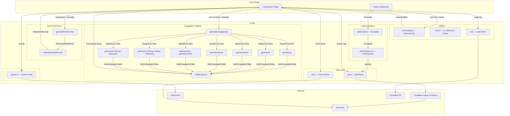

# `src/lib` — The Logic Layer

## The Responsibility

This folder is the **brain without a face**.

Its single job is to **transform, compute, and move data** — turning raw root consonants into fully conjugated Maltese verb tables, attaching pronoun clitics with the correct phonological shifts, resolving bilingual terminology, and shuttling payloads between the client and the backend. Every function here takes data in and returns data out; nothing here decides *how* things look.

In concrete terms, it is responsible for:

- **Morphological generation** — algorithmically producing verb conjugations across all persons, tenses, polarities, and verb classes (strong, assimilative, hollow, geminated, defective, Forms II & III).
- **Clitic suffixation** — attaching direct-object, indirect-object, and combined DO+IO pronoun suffixes with vowel syncopation, imāla, and negation wrapping.
- **Terminology resolution** — mapping linguistic term keys to their Standard or Arabised Maltese equivalents.
- **Data transport** — calling Cloudflare Pages Functions (via `api.ts`) and Turso DB (via `db.ts`).
- **AI integration** — proxying prompts to Gemini for entry explanations, name generation, and text checking.
- **Admin data shaping** — normalizing JSON blobs (glosses, etymologies, relationships) for the admin UI and building validated payloads before they hit the API.

---

## The Forbidden

| ❌ Never import…     | Why                                                                                          |
| --------------------- | --------------------------------------------------------------------------------------------- |
| `react`, `react-dom`  | This is a **logic-only** zone. `adminConfig.tsx` is the sole exception (it provides a React context for config state) and should be considered on the boundary. |
| `src/components/*`    | Components consume `lib`, never the other way around.                                         |
| `src/pages/*`         | Pages orchestrate; `lib` serves.                                                             |
| CSS / Tailwind files  | Styling utilities (`cn`, color helpers in `utils.ts`) are output-only — they return class name *strings*, they don't import stylesheets. |
| Direct DOM APIs       | No `document.querySelector`, no `window.location` manipulation. Data in → data out.           |

---

## The Flow

> *"I am a piece of data entering this folder. What is my journey?"*

### Path 1 — Conjugation (the main event)

You are a **root** — a bundle of consonants like `k-t-b`, a verb form ("I"), a strength class ("strong"), and a vowel set ("i-e"). You enter `generateConjugation()`. Based on your strength, you are dispatched to one of the specialised generators (`genStrong`, `genHollow`, `genGeminated`, `genAssimilative`, `genDefective`, `genDefectiveGħ`, `genFormIIStrong`, etc.). Each generator stamps you into a full 18-row conjugation table — perfect and imperfect, positive and negative, singular and plural, with pre-calculated Type 1 (attached) and Type 2 (syncopated) stems. You emerge as a `VerbConjugationTable`.

If the user toggles a pronoun suffix, your stems are passed to `suffixEngine.ts` — which syncopates, applies reverse imāla, collapses `ie`, attaches the correct DO/IO clitic, and wraps you in `ma…x` negation. You come out as a final display string.

### Path 2 — Root form generation

You are a root that wants to show *all possible forms* (Form I, II, III). You enter `generateRootForms()`, which fans you out into `generateTriliteralStrong()`, `generateTriliteralGeminated()`, etc. Each returns an array of `GeneratedVerbForm` objects (perfect, imperfect, participles, verbal noun per form marker). Then `markGeneratedForms()` cross-references you against attested dictionary entries to tag each form as `attested`, `unattested`, or `irregular`.

### Path 3 — Data fetch & admin CRUD

You are a user action — a search query, a root edit, an entry save. `api.ts` wraps you in an `apiFetch()`  call to a Cloudflare Pages Function. Before you leave, `adminSchema.ts` may serialise your complex fields (glosses → JSON), and `adminUtils.ts` may normalise your etymology or relationship arrays. On return, `db.ts` can query Turso directly for entry lookups and search.

### Path 4 — AI features

You are a prompt. `gemini.ts` initialises a singleton `GenerativeModel`, wraps you in a system instruction, and sends you to Gemini Flash. You return as a chat reply, an entry explanation, a set of name suggestions, or a spelling-correction payload.

---

## Flow Diagram

